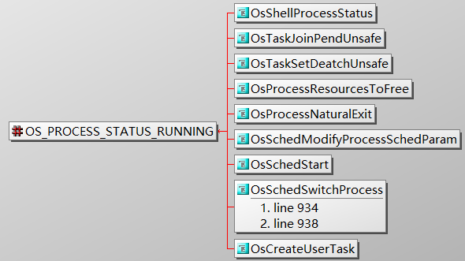
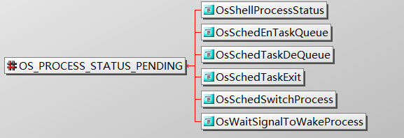
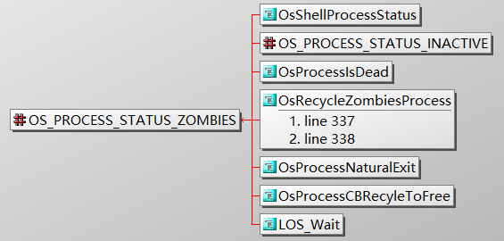

###### 进程状态迁移示意图

##### 1. 初始化（Init）：该进程正在被创建。

 - 删除PCB时设置进程为非初始化状态
 - 当进程被调度时设置为非初始化和非阻塞状态
 - PCB初始化时将进程设置为init

##### 2. 就绪（Ready）：该进程在就绪列表中，等待CPU调度。

##### 3. 运行（Running）：该进程正在运行。

##### 4. 阻塞（Pending）：该进程被阻塞挂起。本进程内所有的线程均被阻塞时，进程被阻塞挂起。

##### 5. 僵尸态（Zombies）：该进程运行结束，等待父进程回收其控制块资源。

